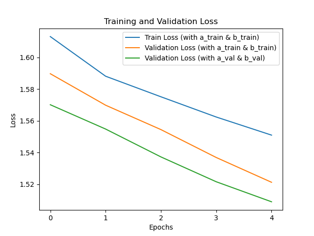

# BAM TEst

## Description

This project is designed to demonstrate the code for utlising BERT to anlyse textual information in forcasting the coefficients of AR1 model.

Please run ```./main.py ``` to generate results

## Dependencies

- PyTorch
- Transformers
- NumPy
- Matplotlib

## Results example



## Additional Details

For further details and technical information, refer to the 'details.pdf' document.
